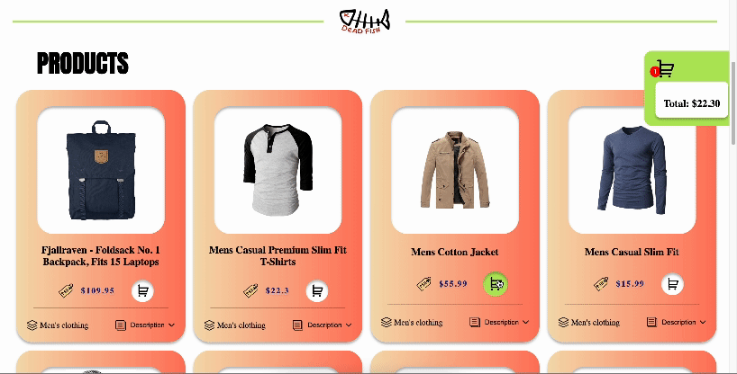
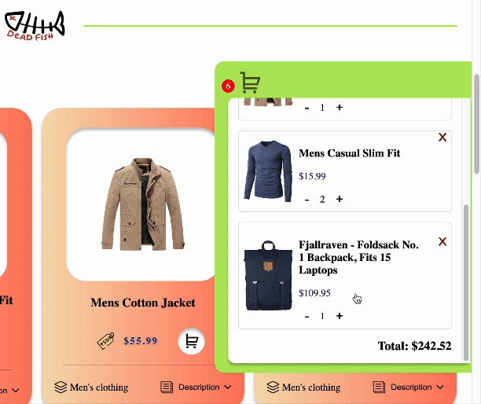

# Mid Term - Fake Shop

## DONE ✅

## The finished images of the project are as follows.

### Project Schema drawen by Goktug YILDIZ


## Home Page


## Filter By Category


## Add to Cart



## Cart



## Description of product


## Below you can find the directives given by CICCC

## Description

In this project, you will create a fake shop using OOP. You will create classes for each entity and use them to create the shop.

## Objectives

- Create one file per class and import where needed
- Show a list of products from an API, with image, title, price and description
- Be able to add products to the cart
- Show the total amount of the cart

## Instructions

### HTML

To see the final result, you can use the `static.html` file as reference.

### Entities (classes)

- Product
- ShoppingCart
- ProductItem
- ProductList
- Shop
- App

### Step 1 - Product class

Create a class called `Product` that will have the following properties:

```js
const product = {
  id: 1,
  title: "...",
  price: 0,
  description: "...",
  image: "...",
};
```

Test your class by creating a new instance of it with hardcoded values and printing it to the console.

### Step 2 - Product Item

Create a class called `ProductItem` that will have the following properties:

```js
const productItem = {
  product: {}, // instance of Product class
  addToCart() {
    // just console.log the product for now
  },
  render() {
    // return the product element with the product data (<li>)
  },
};
```

Test your class by creating a new instance of it with hardcoded values and calling the `render` method. Also, test the `addToCart` method by clicking on the button and check if shows the product in the console.

### Step 3 - Product List

Create a class called `ProductList` that will have the following properties:

```js
const productList = {
  products: [],
  fetchProducts: function () {
    // fetch the products from the API
  },
  render() {
    // render the products by looping through the products array and create a new ProductItem instance for each product. Use render method of ProductItem class to get each product element and append it to the `<ul>`.
  },
};
```

> API to be used: https://fakestoreapi.com/products

### Step 4 - ShoppingCart

Create a class called `ShoppingCart` that will have the following properties:

```js
const shoppingCart = {
  items: [],
  getTotal() {
    // calculate the total price of the items in the cart
  },
  render() {
    // render the total and a button `order now` in a `<section>` element
  },
};
```

### Step 5 - Shop

Create a class called `Shop` that will have the following properties:

```js
const shop = {
  render() {
    // render the shop by calling the render method of ProductList and ShoppingCart classes
  },
};
```

> Tip: You might need to change the `render` method of `ProductList` and `ShoppingCart` classes to return the element instead of appending it to the DOM.

### Step 6 - Adding products to the cart

Create a new class called `App` that will have the following properties:

```js
const app = {
  init() {
    // initialize the app by creating instance of Shop class and calling the render method of the Shop class
  },
  addProductToCart() {
    // add the product to the cart by calling the addToCart method of Cart class
  },
};
```

Modify your `Cart` class by adding a new method called `addProduct` that will add the product to the `items` array.

> Tip: You might need to make `addProductToCart` and `init` as static method. Search for static methods in JavaScript.

Modify your method `addToCart` inside `ProductItem` class that will call the `addProductToCart` method of `App` class.

Initialize your application by calling the `init` method of `App` class.

### Step 7 - Update total amount

Modify your `ShoppingCart` class by adding a new setter method that will update the total amount of the cart everytime that a new product is added to the cart.
